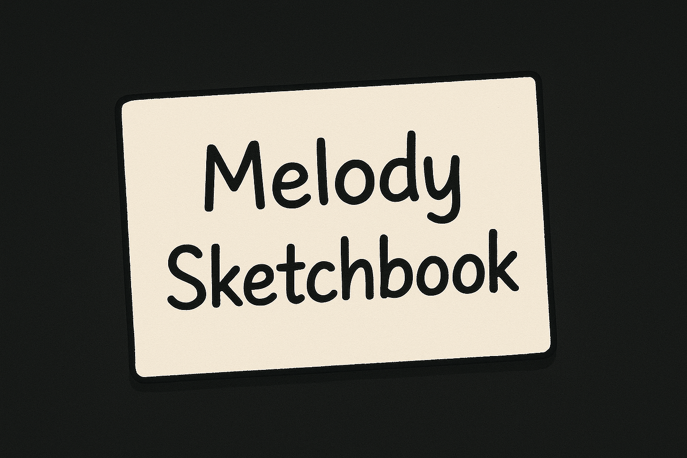
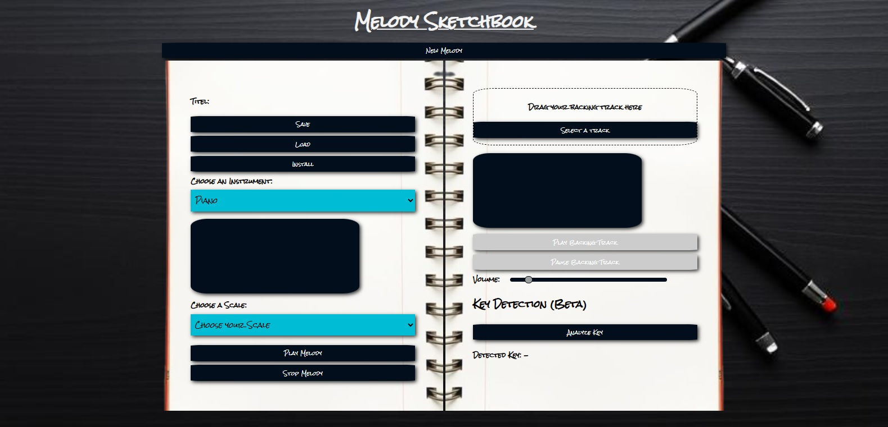

  

## Table of Contents
- [Short Description](#short-description)  
- [Showcase](#showcase)  
- [Key Features](#key-features)  
- [Technologies Used](#technologies-used)  
- [Challenges & Lessons Learned](#challenges--lessons-learned)  
- [Getting Started (Local Setup)](#getting-started-local-setup)  
- [Live Demo](#live-demo)  
- [Notes](#notes)  

---

## Short Description
**Melody Sketchbook** is a browser-based app that lets you **draw melodies on a canvas**.  
Choose any key (major, minor, or chromatic) and automatically play notes that fit the selected scale.  
Save, load, and play your melodies, or write along with a backing track – all in your browser!  

---

## Showcase
### Screenshots
<p align="center">
  
</p>

### GIF Demo


### YouTube Demo Video
[Watch the Demo on YouTube](https://youtu.be/zcmVr0ewzcM)

---

## Key Features
- **Scale Selection:** Major, minor, chromatic – automatically selects the correct notes from a JSON file.  
- **Interactive Canvas:** Draw melodies directly on a piano-like canvas.  
- **Dynamic Sound:** Notes are loudest in the center octave and fade at the top/bottom.  
- **Melody Management:** Save, load, and play melodies in **local storage**.  
- **Backing Tracks:** Import a backing track and compose melodies along with it.  
- **Key Detection (Beta):** Automatically detects the key of your backing track (currently experimental and may not always give correct results).  

---

## Technologies Used
- **Languages:** JavaScript, HTML, CSS  
- **Data:** JSON for scale definitions  
- **Audio:** Native browser Audio API  
- **Storage:** Local Storage for saving/loading melodies  

---

## Challenges & Lessons Learned
- **Scale Mapping:** Learned how to map notes dynamically from JSON files to stay in key.  
- **Canvas Interaction:** Built an interactive piano canvas that responds visually and sonically.  
- **Audio Mixing:** Implemented dynamic volume across octaves.  
- **Local Storage:** Managed saving/loading melodies efficiently.  
- **Key Detection (Beta):** Explored audio analysis to detect the key from backing tracks.  

---

## Getting Started (Local Setup)
1. Clone the repository:  
   ```bash
   git clone https://github.com/MarcelFelder-git/melody-sketchbook
   ````

2. Navigate to the project directory:
   ```bash
   cd melody-sketchbook
   ````

3. Open the project with a local server (recommended: Live Server
 in VS Code).
   - Right-click index.html → "Open with Live Server"
   
4. The application will run in your browser at:
   ```arduino
   http://localhost:5500
   ````

---

## Live Demo
Try out **Melody Sketchbook** here:  

[Melody Sketchbook on Vercel](https://04-melody-sketchbook.vercel.app/)

---

## Notes
- The app is **still under development** and some features may be buggy.  
- **Known Issues:**  
  - Saving/loading melodies sometimes behaves unexpectedly.  
  - Key detection is in **beta** and may return incorrect keys.  
- Future improvements:  
  - Full bugfixes for melody storage  
  - Improved key detection algorithm  
  - Additional audio effects and UI polish  

> This project was built as part of my **Frontend Developer training**, focusing on JavaScript audio handling, canvas interaction, and dynamic UI feedback.
